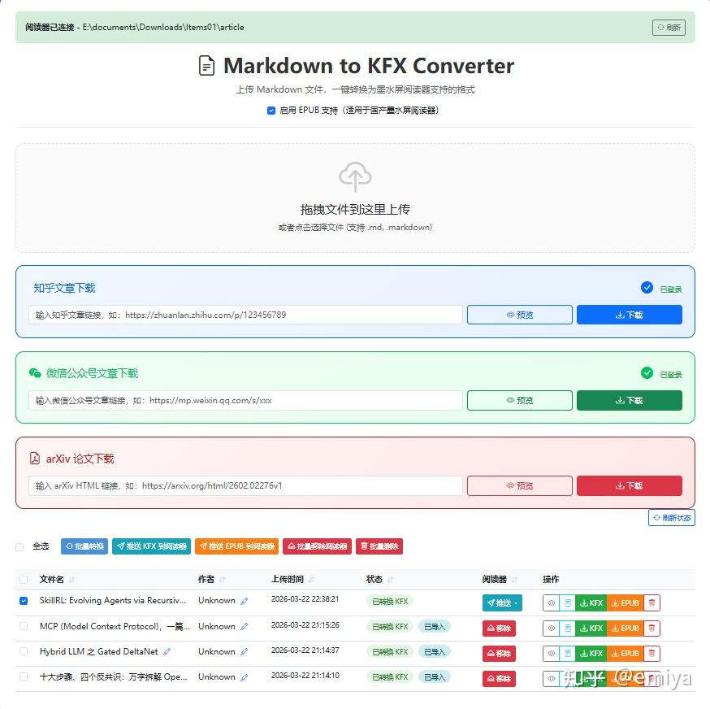
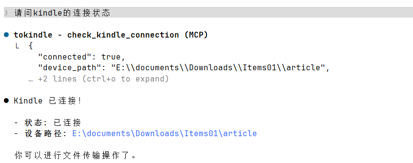
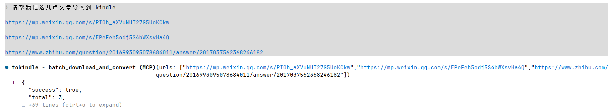
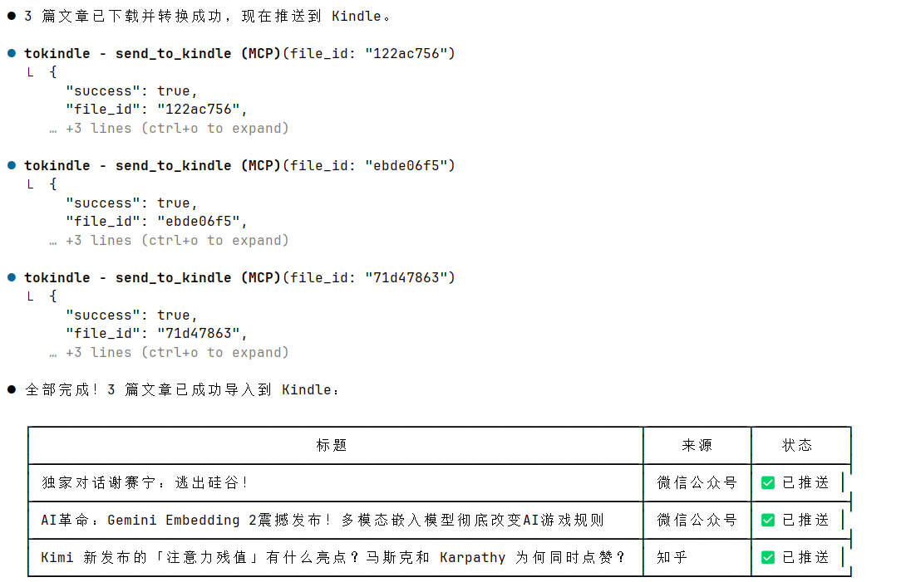

# toEreader


> **2026-05-24 更新**：MCP Server 已支持 **stdio 传输模式**，可接入任何兼容 MCP stdio 协议的 AI Agent 框架。
>
> 以 Hermes Agent 为例，在 `~/.hermes/config.yaml`（Windows 为 `%AppData%\Local\hermes\config.yaml`）中配置：
>
> ```yaml
> mcp_servers:
>   tokindle:
>     command: /path/to/your/python       # Python 解释器绝对路径
>     args:
>       - /path/to/tokindle/mcp_server.py  # 项目 mcp_server.py 的绝对路径
>       - --transport
>       - stdio
> ```
>
> 配置完成后重启 Agent，即可在对话中直接调用 tokindle 的下载、转换、推送 Kindle 等工具。
>
> **使用示例（直接在对话中说即可，无需手动调用工具）：**
>
> - 下载文章：`帮我下载这篇微信文章 https://mp.weixin.qq.com/s/xxx`
> - 下载并导入 Kindle：`下载这篇知乎文章并推送到 Kindle https://zhuanlan.zhihu.com/p/xxx`
> - 批量下载：`批量下载这几篇：url1, url2, url3`
> - 查看 Kindle 连接状态：`检查 Kindle 是否已连接`
> - 推送指定文件：`把文件 abc123 推送到 Kindle`
>
> Agent 会自动识别意图并调用对应 MCP 工具，无需记忆工具名称。
>
> sse 配置方式见下方 [MCP Server 配置与调试指南](#-mcp-server-配置与调试指南)。

-----

### 将网络文章转换为墨水屏阅读器友好格式的工具集。

- 支持通过页面下载、转换、导入文章到 kindle



- 支持通过 mcp 下载、管理和导入





项目介绍: 
  - https://zhuanlan.zhihu.com/p/2019355339670189711

## 支持的阅读器

本项目支持以下墨水屏阅读器设备：

### Kindle 系列
  - 导入 KFX 格式


### 国产墨水屏阅读器（EPUB 格式）
  - 导入 EPUB 格式

> **说明**：国产阅读器大多原生支持 EPUB 格式，无需转换为 KFX。本工具同时输出 KFX 和 EPUB 两种格式，您可以根据设备选择合适的格式导入。

---

## 重要提示

- 目前仅支持了 Windows，Mac 尚未适配，欢迎大佬帮个忙测测，改改代码
- 对于 Kindle Paperwhite 6 等设备：
  - Windows 中 KPW6 等使用的是 MTP（媒体传输协议）模式，在 Windows 中显示为便携设备/媒体设备，而不是传统的 U 盘模式（大容量存储设备）
  - 连接后 Windows 不会给设备分配盘符，因此无法直接使用该 WebUI 导入到 Kindle
    - 方法1:
      - windows 电脑安装 mtpdriver， 为 mtp 设备分配一个盘符，此时就可以直接使用原来的方法
    - 方法2
      - 只能将本地的一个文件夹当作导出的文件夹（修改 `src/config.py` 中的 `KINDLE_ARTICLE_PATH`）
      - 然后手动将转换好的 KFX/EPUB 导入到设备当中
    - 方法3
      - 使用实验性质的功能，利用powershell进行文件传输
      - (目前尚未开发)
    
      

---

## 项目功能与目标

本项目旨在帮助用户将网络文章（知乎专栏、微信公众号、arXiv 论文等）转换为墨水屏阅读器可读的电子书格式。

**核心功能：**

- **知乎文章下载**：抓取知乎专栏文章并转换为 Markdown，支持公式、代码块、图片等
- **微信公众号文章下载**：抓取微信公众号文章，保留原文格式
- **arXiv 论文下载**：从 arXiv 下载学术论文，转换为 Markdown 格式
- **Markdown 转电子书**：将 Markdown 文件转换为 KFX/EPUB 格式，支持目录、数学公式、代码高亮等
- **Web 界面**：提供简洁的 Web 界面，一站式完成下载和转换

**转换特点：**

- 数学公式支持（LaTeX/MathML）
- 代码块语法高亮并转为图片（适配墨水屏）
- 自动生成目录
- 图片自动下载并优化
- 同时输出 KFX 和 EPUB 两种格式

---

## 目录结构

```
tokindle/
├── src/
│   ├── downloader/                    # 文章下载器模块
│   │   ├── zhihu2markdown.py          # 知乎文章下载器
│   │   ├── wechat2markdown.py         # 微信公众号下载器
│   │   └── arxiv2markdown.py          # arXiv 论文下载器
│   ├── tools/                         # 共享工具模块
│   │   ├── database.py                # 数据库操作
│   │   ├── kindle.py                  # Kindle 设备操作
│   │   └── file_manager.py            # 文件管理
│   ├── config.py                      # 配置文件
│   └── md2kfx.py                      # Markdown 转 KFX/EPUB 核心模块
├── webui/
│   ├── app.py                         # Flask Web 服务
│   └── templates/
│       └── index.html                 # Web 界面模板
├── mcp_server.py                      # MCP 服务入口
├── mcp_tools/                         # MCP 工具模块
│   ├── __init__.py
│   ├── download.py                    # 下载转换工具
│   ├── kindle.py                      # Kindle 管理工具
│   └── file_manager.py                # 文件管理工具
├── config/
│   ├── zhihu_cookies.json             # 知乎登录 Cookie（自动生成）
│   └── wechat_cookies.json            # 微信 Cookie（自动生成）
├── uploads/                           # 上传文件临时目录
├── outputs/                           # 转换输出目录
├── requirements.txt                   # Python 依赖
└── README.md                          # 本文档
```

---

## 安装指南

### 第一步：安装 Python

**Windows 用户：**

1. 访问 [Python 官网](https://www.python.org/downloads/) 下载 Python 3.8 或更高版本
2. 运行安装程序，**务必勾选 "Add Python to PATH"**（将 Python 添加到环境变量）
3. 打开命令提示符（按 Win+R，输入 `cmd`，回车），输入以下命令验证安装：
   ```bash
   python --version
   ```

**Mac 用户：**

Mac 通常已预装 Python。打开终端，输入：
```bash
python3 --version
```

### 第二步：下载项目

**方式一：使用 Git（推荐）**

```bash
git clone https://github.com/your-username/tokindle.git
cd tokindle
```

**方式二：直接下载**

1. 点击项目页面的 "Code" -> "Download ZIP"
2. 解压到任意目录
3. 进入解压后的目录

### 第三步：创建虚拟环境（推荐）

**Windows：**
```bash
# 创建虚拟环境
python -m venv venv

# 激活虚拟环境
venv\Scripts\activate
```

**Mac/Linux：**
```bash
python3 -m venv venv
source venv/bin/activate
```

### 第四步：安装依赖

```bash
pip install -r requirements.txt
```

依赖列表：
- markdown - Markdown 解析
- beautifulsoup4 - HTML 解析
- requests - HTTP 请求
- Pillow - 图片处理
- EbookLib - EPUB 生成
- pygments - 代码语法高亮
- flask - Web 框架
- latex2mathml - LaTeX 公式转换

### 第五步：安装 Calibre 和 Kindle Previewer 3（仅 KFX 格式需要）

> **注意**：如果您只使用 EPUB 格式（适用于国产墨水屏阅读器），可以跳过此步骤。

如需将 Markdown 转换为 KFX 格式，**必须同时安装以下软件**：

#### 5.1 安装 Calibre

1. 访问 [Calibre 官网](https://calibre-ebook.com/download) 下载安装
2. 安装完成后，确保 `ebook-convert` 命令可用
3. Windows 用户可能需要将 Calibre 安装目录（默认 `C:\Program Files\Calibre2`）添加到系统环境变量 PATH

#### 5.2 安装 Kindle Previewer 3

1. 访问 [Amazon Kindle Previewer 3 下载页面](https://www.amazon.com/Kindle-Previewer/b?ie=UTF8&node=21381691011) 下载
2. 或直接下载：[Windows 版本](https://kindlepreviewer.s3.amazonaws.com/KindlePreviewerInstaller.exe)
3. 运行安装程序，按提示完成安装
4. 安装完成后，Kindle Previewer 会自动注册 KFX 转换插件到 Calibre

#### 5.3 安装 KFX Output 插件（Calibre 插件）

安装完 Calibre 后，还需要安装 KFX Output 插件：

1. 打开 Calibre
2. 点击菜单 **首选项** (Preferences) → **插件** (Plugins)
3. 点击 **获取新插件** (Get new plugins)
4. 搜索 **"KFX Output"**
5. 选择该插件并点击 **安装** (Install)
6. 安装完成后重启 Calibre

**或者手动安装：**

1. 从 [Calibre 插件页面](https://www.mobileread.com/forums/showthread.php?t=291290) 下载 KFX Output 插件 zip 文件
2. 打开 Calibre → 首选项 → 插件
3. 点击 **从文件加载插件** (Load plugin from file)
4. 选择下载的 zip 文件安装
5. 重启 Calibre

**重要说明：**
- Calibre 负责 EPUB 生成和格式转换
- Kindle Previewer 3 提供 KFX 渲染引擎
- KFX Output 插件将两者连接，实现 EPUB → KFX 转换
- 三个组件缺一不可，否则 KFX 转换会失败

### 第六步：安装 Playwright（可选，用于浏览器模式）

部分网站需要使用浏览器模式抓取：

```bash
pip install playwright
playwright install chromium
```

---

## 配置说明

编辑 `src/config.py` 可以自定义以下配置：

```python
# 希望导入的阅读器的文件夹的 path
# 如果阅读器是 kpw6 等需要使用 mtp 协议的
# 建议设置为一个本地路径手动拷入，或者使用 mtpdriver等工具映射盘符
KINDLE_ARTICLE_PATH = Path("E:/documents/Downloads/Items01/article")
```

---

## 使用指南

### Web 界面使用方法 

> **重要提示：使用 Web 界面前，请先登录获取 Cookie！**
>
> - 知乎文章下载：需要先完成知乎登录获取 Cookie，详见 [知乎 Cookie 获取方法](#知乎-cookie-获取方法)
> - 微信公众号下载：部分文章需要登录，详见 [微信公众号 Cookie 获取方法](#微信公众号-cookie-获取方法)
> - arXiv 论文下载：无需登录，可直接使用
>
> 未获取 Cookie 时，Web 界面的知乎和微信下载功能将无法正常工作。

**启动服务：**

```bash
cd tokindle
python webui/app.py
```


启动后，浏览器访问 http://127.0.0.1:5006 即可使用 Web 界面。

  - 端口号在 src/config.py 里面也可以配置


**Web 界面功能：**

1. **文章下载**：输入知乎/微信/arXiv 链接，一键下载文章
2. **文件上传**：上传本地 Markdown 文件进行转换
3. **格式转换**：将 Markdown 转换为 KFX/EPUB 格式
4. **批量处理**：支持批量下载和转换
5. **推送管理**：支持推送 KFX 或 EPUB 到阅读器

**格式选择建议：**

| 设备类型      | 推荐格式 |
|-----------|---------|
| Kindle 系列 | KFX |
| 国产品牌      | EPUB |

---

### MCP 服务（Claude Desktop / Claude Code）

本项目提供了 MCP (Model Context Protocol) 服务，可以在 Claude Desktop 或 Claude Code 中直接调用 tokindle 的功能。

**功能概述：**
- `download_and_convert` - 从 URL 自动下载并转换为 KFX/EPUB（支持知乎、微信、arXiv）
- `batch_download_and_convert` - 批量并行下载并转换多篇文章
- `search_files` - 按关键字搜索文件
- `send_to_kindle` / `delete_from_kindle` - Kindle 设备文件管理
- `list_files` / `get_file_info` / `delete_file` - 文件管理
- `check_kindle_connection` / `list_kindle_files` - Kindle 设备状态

---

#### 📖 MCP Server 配置与调试指南

本项目支持两种运行模式：**开发调试模式 (SSE)** 和 **生产使用模式 (Stdio)**。

##### 1. 开发调试模式 (SSE)

如果你需要对代码进行断点调试（Breakpoint Debugging），请使用 SSE 模式。

**第一步：启动本地 Python 服务**

在你的 IDE（如 VS Code）中直接运行 `mcp_server.py`。确保代码中配置了正确的端口：

```python
# mcp_server.py
if __name__ == "__main__":
    mcp.run(transport="sse", host="127.0.0.1", port=48000)
```

**第二步：配置 Claude Code**

在 Claude Code 中通过以下命令连接到正在运行的服务：

```bash
/mcp add sse http://127.0.0.1:48000/sse
```

或者手动修改配置文件：

```json
"tokindle-debug": {
  "type": "sse",
  "url": "http://127.0.0.1:48000/sse"
}
```

**优点：**
- 可以在 IDE 中打断点，实时观察变量
- 修改代码后重启 Python 脚本即可，无需频繁改动 Claude 配置

##### 2. 生产使用模式 (Stdio)

当你完成开发，希望 Claude 自动管理 Server 的启动和关闭时，请使用 Stdio 模式。

**第一步：修改代码启动方式**

确保你的 `mcp_server.py` 默认使用 stdio（这是 FastMCP 的默认值）：

```python
if __name__ == "__main__":
    mcp.run(transport="stdio")
```

**第二步：配置 Claude Code**

使用绝对路径添加服务：

```bash
/mcp add python /path/to/tokindle/mcp_server.py
```

对应的配置文件内容如下：

```json
"tokindle": {
  "type": "stdio",
  "command": "python",
  "args": ["/path/to/tokindle/mcp_server.py"]
}
```

**优点：**
- 无需手动运行 Python 脚本，Claude 启动时会自动拉起该进程

##### 3. 常见操作流程对比

| 场景 | 传输协议 | 如何应用代码修改 | 调试方法 |
|------|----------|------------------|----------|
| 日常开发 | sse | 重启 Python 脚本即可 | IDE 断点、print()、logging |
| 稳定使用 | stdio | 在 Claude Code 中执行 `/mcp reload` | 查看 Claude 输出日志 |

---

#### Claude Desktop 配置

1. 找到 Claude Desktop 配置文件：
   - **Windows**: `%APPDATA%\Claude\claude_desktop_config.json`
   - **macOS**: `~/Library/Application Support/Claude/claude_desktop_config.json`

2. 添加 MCP 服务器配置：

```json
{
  "mcpServers": {
    "tokindle": {
      "command": "python",
      "args": ["/path/to/tokindle/mcp_server.py"],
      "env": {}
    }
  }
}
```

> 注意：将 `/path/to/tokindle/mcp_server.py` 替换为你的实际项目路径。

3. 重启 Claude Desktop，即可在对话中使用 tokindle 的功能。

#### Claude Code 配置

在项目根目录创建或编辑 `.claude/settings.json`：

```json
{
  "mcpServers": {
    "tokindle": {
      "command": "python",
      "args": ["${workspaceFolder}/mcp_server.py"]
    }
  }
}
```

#### 使用示例

配置完成后，你可以在 Claude 中直接说：

- "帮我下载这篇知乎文章并转换：https://zhuanlan.zhihu.com/p/xxx"
- "批量下载这几篇文章：[url1, url2, url3]"
- "搜索包含'机器学习'的文件"
- "把这篇文章推送到 Kindle"

Claude 会自动调用 MCP 工具完成操作，转换结果可以在 Web UI (`http://127.0.0.1:5006`) 中查看。

---

### 方式二：命令行使用

#### 1. 知乎文章下载器 (zhihu2markdown)

将知乎专栏文章转换为 Markdown 格式。

**登录获取 Cookie**

```bash
# 交互式登录，会打开浏览器让你手动登录
python "src/downloader/zhihu2markdown.py" login
```

登录成功后，Cookie 会自动保存到 `config/zhihu_cookies.json`。

**检查登录状态**

```bash
# 检查登录状态
python "src/downloader/zhihu2markdown.py" login --check
```

**下载文章：**

```bash
# 基本用法（使用已保存的 Cookie）
python "src/downloader/zhihu2markdown.py" fetch https://zhuanlan.zhihu.com/p/123456789

# 指定输出目录
python "src/downloader/zhihu2markdown.py" fetch https://zhuanlan.zhihu.com/p/123456789 -o ./output

```

**支持的 URL 格式：**

- 专栏文章：`https://zhuanlan.zhihu.com/p/123456789`
- 问题回答：`https://www.zhihu.com/question/xxx/answer/yyy`

**命令一览：**

| 命令 | 说明 |
|------|------|
| `login` | 交互式登录，打开浏览器手动登录 |
| `login -c "cookie"` | 从字符串导入 Cookie |
| `login --check` | 检查登录状态 |
| `fetch <url>` | 下载文章 |
| `fetch <url> -o dir` | 指定输出目录 |
| `fetch <url> --browser` | 浏览器模式下载 |

---

#### 2. 微信公众号文章下载器 (wechat2markdown)

将微信公众号文章转换为 Markdown 格式。

**设置 Cookie **

```bash
# 交互式登录（会打开浏览器让你扫码登录微信）
python "src/downloader/wechat2markdown.py" login

# 检查登录状态
python "src/downloader/wechat2markdown.py" login --check
```

**下载文章：**

```bash
# 使用文章 URL
python "src/downloader/wechat2markdown.py" fetch "https://mp.weixin.qq.com/s/xxx"

# 指定输出目录
python "src/downloader/wechat2markdown.py" fetch "https://mp.weixin.qq.com/s/xxx" -o ./output
```

**支持的输入格式：**

- 微信文章链接：`https://mp.weixin.qq.com/s/xxx`

**命令一览：**

| 命令 | 说明 |
|------|------|
| `login` | 交互式登录 |
| `login -c "cookie"` | 从字符串导入 Cookie |
| `login --check` | 检查登录状态 |
| `fetch <url>` | 下载文章 |
| `fetch <url> -o dir` | 指定输出目录 |

---

#### 3. arXiv 论文下载器 (arxiv2markdown)

将 arXiv 论文转换为 Markdown 格式。

**特点：**

- 无需登录
- 支持数学公式（LaTeX 格式）
- 自动提取标题、作者、摘要

**下载论文：**

```bash
# 基本用法
python "src/downloader/arxiv2markdown.py" https://arxiv.org/html/2602.02276v1

# 或使用 abs 链接（自动转换为 html 链接）
python "src/downloader/arxiv2markdown.py" https://arxiv.org/abs/2602.02276

# 指定输出目录
python "src/downloader/arxiv2markdown.py" https://arxiv.org/html/2602.02276v1 -o ./output

# 自定义标题和作者
python "src/downloader/arxiv2markdown.py" https://arxiv.org/html/2602.02276v1 -t "论文标题" -a "作者"
```

**支持的 URL 格式：**

- HTML 页面：`https://arxiv.org/html/2602.02276v1`
- 摘要页面：`https://arxiv.org/abs/2602.02276`

**命令一览：**

| 命令 | 说明 |
|------|------|
| `fetch <url>` | 下载论文 |
| `fetch <url> -o dir` | 指定输出目录 |
| `fetch <url> -t "标题"` | 自定义标题 |
| `fetch <url> -a "作者"` | 自定义作者 |

---

#### 4. Markdown 转 KFX/EPUB (md2kfx.py)

将 Markdown 文件转换为 KFX/EPUB 格式。

**基本用法：**

```bash
python src/md2kfx.py input.md -o output.kfx -a "作者名"
```

**参数说明：**

| 参数 | 说明 |
|------|------|
| `input` | 输入的 Markdown 文件路径 |
| `-o, --output` | 输出文件路径（可选，默认与输入同名） |
| `-a, --author` | 作者名称（可选，默认 "Unknown"） |
| `--skip-mathml` | 跳过 MathML 转换（提高 KFX 兼容性） |

**示例：**

```bash
# 基本转换
python src/md2kfx.py article.md

# 指定输出文件和作者
python src/md2kfx.py article.md -o mybook.kfx -a "张三"

# 跳过数学公式转换
python src/md2kfx.py article.md --skip-mathml
```

**转换特性：**

- 自动下载远程图片
- 代码块转为语法高亮图片
- 数学公式支持（LaTeX/MathML）
- 自动生成目录
- 图片格式优化（GIF/WebP 转 PNG）
- 同时输出 KFX 和 EPUB 格式

---

## 如何获取 Cookie

### 知乎 Cookie 获取方法

**方式一：使用自动登录（推荐）**

```bash
python "src/downloader/zhihu2markdown.py" login
```

程序会自动打开浏览器，登录后自动保存 Cookie。


### 微信公众号 Cookie 获取方法

与知乎类似，访问微信公众号文章页面后从开发者工具获取 Cookie。
- 注意，你必须要先创建一个微信公众号并绑定微信，才可以使用此功能


---

## 常见问题

### Q: 微信登录为什么需要一个公众号

- 一般来说，当你希望访问微信的文章，你需要使用相应的 cookie
- 但是电脑通过python获取到微信本身的cookie是比较困难的，但是微信的微信公众号是可以网页登录的，你可以通过登录微信公众号获取cookie
- 微信公众号的注册是比较简单的


### Q: KFX 转换失败？

A: 确保 KFX 转换所需的三个组件都已正确安装：

1. **Calibre** - 确保已安装且 `ebook-convert` 命令可用
2. **Kindle Previewer 3** - 确保已安装（提供 KFX 渲染引擎）
3. **KFX Output 插件** - 确保已在 Calibre 中安装该插件

检查步骤：
- 打开 Calibre → 首选项 → 插件，确认 KFX Output 插件已启用
- 确认 Kindle Previewer 3 已安装并能正常打开
- 尝试在 Calibre 中手动转换一本 EPUB 为 KFX，测试是否成功

如果仍有问题，尝试使用 `--skip-mathml` 参数跳过数学公式转换。

**或者使用 EPUB 格式**：如果您使用的是国产墨水屏阅读器，可以直接使用 EPUB 格式，无需安装上述组件。

### Q: 浏览器模式报错？

A: 安装 Playwright：

```bash
pip install playwright
playwright install chromium
```

### Q: Windows 下中文乱码？

A: 确保终端编码为 UTF-8：
```bash
chcp 65001
```


## 依赖说明

| 依赖 | 用途 |
|------|------|
| markdown | Markdown 解析和转换 |
| beautifulsoup4 | HTML 内容解析 |
| requests | HTTP 请求处理 |
| Pillow | 图片处理和格式转换 |
| EbookLib | EPUB 电子书生成 |
| pygments | 代码语法高亮 |
| flask | Web 服务框架 |
| latex2mathml | LaTeX 公式转 MathML |
| playwright | 浏览器自动化（可选） |
| mcp | MCP 服务（可选，用于 Claude 集成） |

---

## License

MIT License